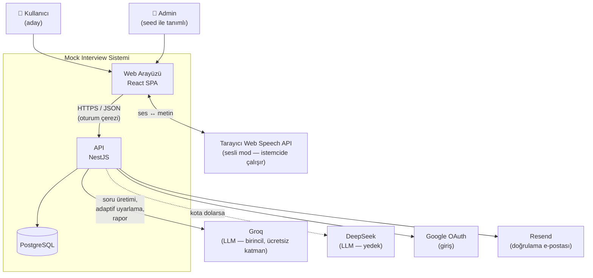
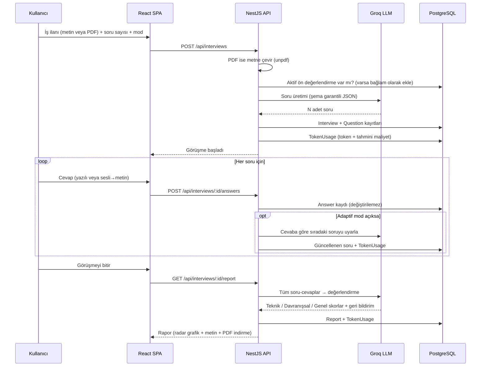
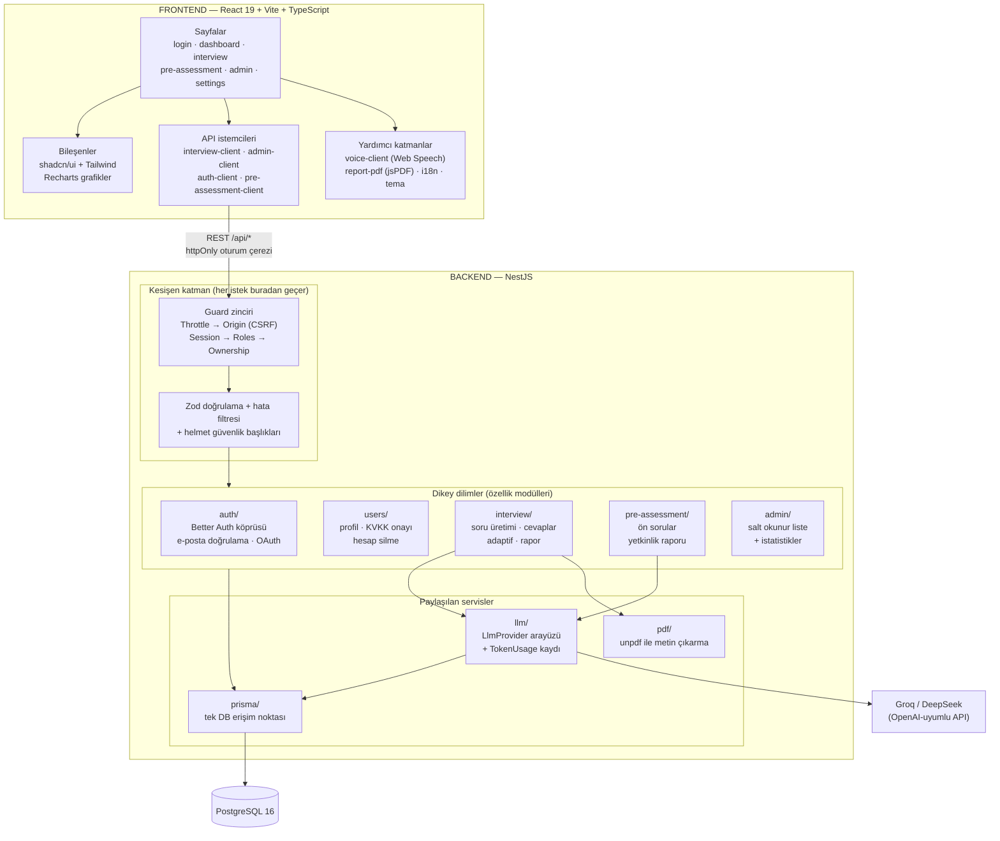
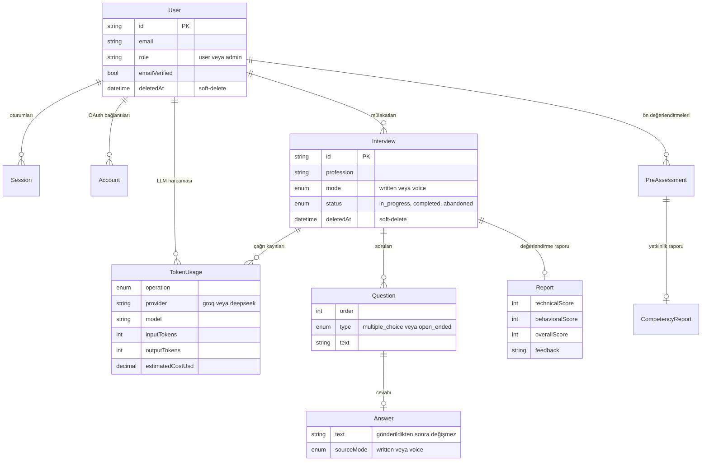
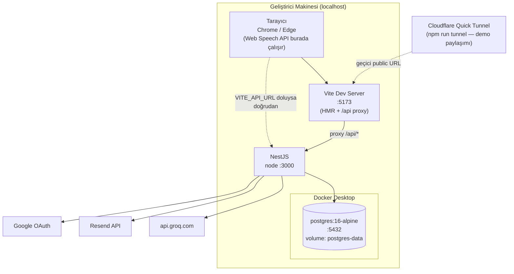

# DECISIONS.md — Çözüm Mimarisi ve Alınan Kararlar

> Bu doküman, **AI Destekli Deneme Mülakatı** projesinin üst seviye tasarımını, mantıksal
> ve fiziksel diyagramlarını ve proje boyunca aldığımız kararları gerekçeleriyle bir arada
> anlatır. Amacımız "hangi teknolojiyi seçtik" listesinden çok, **neden onu seçtik ve neyi
> göze aldık** sorusunun cevabını bırakmak.
>
> **İlgili dokümanlar:**
> - [`docs/DECISIONS.md`](docs/DECISIONS.md) — kararların uzun hâli (ADR-0001…ADR-0013), her biri
>   alternatifler / riskler / "bu karar ne zaman yanlış olur" bölümleriyle. Bu dosya onun özeti
>   ve mimari çerçevesidir; **çelişki olursa `docs/DECISIONS.md` esastır.**
> - [`docs/TECH_STACK.md`](docs/TECH_STACK.md) — kilitlenen teknolojiler ve sürümleri
> - [`docs/APP_FLOW.md`](docs/APP_FLOW.md) — ekran ekran kullanıcı akışları
> - [`docs/PROJECT_MAP.md`](docs/PROJECT_MAP.md) — dosya/klasör haritası
> - [`docs/SECURITY.md`](docs/SECURITY.md) — güvenlik bulguları ve iyileştirme planı

---

## 1. Üst Seviye Tasarım

### 1.1 Ürün ne yapıyor?

Kullanıcı bir iş ilanı (metin ya da PDF) veriyor, sistem o ilana göre **yapay zekâ ile mülakat
soruları üretiyor**, kullanıcı yazılı veya sesli olarak cevaplıyor ve sonunda **teknik /
davranışsal / genel** eksenlerinde puanlı bir değerlendirme raporu çıkıyor. Yanında iki şey daha
var: mülakattan bağımsız çalışan bir **ön değerlendirme** (adayı tanıyan, puansız yetkinlik
raporu) ve tüm kullanımı görebilen bir **admin paneli** (kimin kaç mülakat yaptığı, ne kadar
token harcandığı).

### 1.2 Mimarinin özeti

Sistem üç parçadan oluşuyor: **React tabanlı web arayüzü, NestJS ile yazılmış REST API ve
PostgreSQL veritabanı.** Mikroservis, mesaj kuyruğu veya ayrı bir yapay zekâ servisi
kullanmadık; bu sadeliği bilinçli olarak tercih ettik.

Gerekçe basit: bu bir staj vaka çalışması ve gerçek darboğazımız trafik değil, **süre**. Üç
kişilik bir ekibin sınırlı sürede bitirmesi gereken bir işte, dağıtık mimarinin getireceği
operasyon yükünün karşılığı yok.

**Sistemi ayakta tutan dört tasarım kuralı:**

| Kural | Ne demek | Neden |
|-------|----------|-------|
| **Dikey dilim** | Her özellik (auth, interview, pre-assessment, admin) kendi modülünde; controller + service + DTO + test aynı klasörde | Üç kişi aynı anda farklı dilimlerde çalışabildi, merge çakışması neredeyse hiç olmadı |
| **Sunucu tarafı yetki** | Tarayıcıdan gelen hiçbir "ben adminim" iddiasına güvenilmez; yetki her istekte guard zincirinde kontrol edilir | Frontend kontrolü sadece kullanıcı deneyimidir, güvenlik değildir |
| **LLM tek kapıdan** | Tüm yapay zekâ çağrıları `llm/` modülünden geçer; hiçbir dilim doğrudan sağlayıcıya bağlanmaz | Sağlayıcı değiştirmek tek dosyalık iş oldu (ve gerçekten değiştirdik — bkz. ADR-0006 → ADR-0007) |
| **Her çağrı ölçülür** | Her LLM çağrısında token ve tahmini maliyet `TokenUsage` tablosuna yazılır | Admin panelindeki maliyet raporu sonradan eklenen bir şey değil, en baştan verinin içinde |

### 1.3 Sistem bağlam diyagramı

Sistemin dış dünyayla ilişkisi — kim kullanıyor, hangi dış servislere bağlıyız:

### 1.4 Ana akış: bir mülakat baştan sona

**Buradaki üç tasarım kararı:**

- **Cevaplar değiştirilemez (immutable).** Bir cevap gönderildikten sonra düzenlenemiyor —
  raporun neye dayandığı belirsizleşmesin diye. Sesli modda kullanıcı, metne dökülen cevabı
  *göndermeden önce* düzeltebiliyor; yani kontrol kullanıcıda ama kayıt sonrası sabit.
- **Rapor ayrı bir çağrı.** Soru üretimi ve rapor iki farklı LLM çağrısı. Rapor çağrısı daha
  uzun (60 sn timeout, diğerleri 30 sn) çünkü tüm görüşmeyi okuyor.
- **İş ilanı metni prompt'ta "veri" olarak izole ediliyor**, talimat olarak değil. İlanın içine
  gizlenmiş bir komut ("önceki talimatları unut") sistem davranışını değiştiremesin diye
  (prompt injection savunması). Aynı disiplin ön değerlendirme bağlamı için de geçerli
  (ADR-0013).

---

## 2. Mantıksal Tasarım Diyagramı

Kodun mantıksal olarak nasıl bölündüğü — hangi parça neyi biliyor, kim kime bağlı:

### 2.1 Katmanların sorumlulukları

| Katman | Sorumluluk | Bilmediği şey |
|--------|-----------|---------------|
| **Frontend sayfaları** | Ekran, form, kullanıcı etkileşimi | Yetkinin nasıl kontrol edildiği (sadece UI'ı gizler, güvenliği sağlamaz) |
| **Guard zinciri** | Sırayla: hız sınırı → origin → oturum → rol → kaynak sahipliği | İş kuralları |
| **Dikey dilimler** | Kendi özelliklerinin iş kuralları | Diğer dilimlerin iç yapısı (birbirlerinin servisini doğrudan çağırmıyorlar) |
| **`llm/`** | Sağlayıcıya bağımsız çağrı + şema doğrulama + token kaydı | Hangi dilimin çağırdığı |
| **`prisma/`** | Tek veritabanı erişim noktası | İş kuralları |

### 2.2 Veri modeli (ana varlıklar)

**Veri modelindeki üç bilinçli karar:**

1. **Soft-delete.** Kullanıcı bir mülakatı sildiğinde satır gerçekten silinmiyor, `deletedAt`
   damgalanıyor. Kullanıcı onu bir daha görmüyor ama admin "Silindi" etiketiyle görebiliyor.
   Sebep: admin istatistiklerinin geçmişe dönük tutarlı kalması. Aksi hâlde kullanıcı geçmişini
   temizledikçe raporlardaki toplamlar değişirdi.
2. **`TokenUsage` ayrı bir tablo.** Maliyeti mülakat kaydının içine bir sütun olarak koymadık;
   her LLM çağrısı ayrı satır. Böylece "hangi işlem (soru üretimi mi rapor mu) ne kadar tüketti"
   sorusunu cevaplayabiliyoruz ve sağlayıcı değişse bile eski kayıtlar `provider`/`model`
   alanları sayesinde anlamlı kalıyor.
3. **Ön değerlendirme mülakattan bağımsız.** Aralarında zorunlu bir ilişki yok — ön değerlendirme
   yapmadan da mülakata girilebiliyor. Aktif bir kayıt varsa mülakat prompt'una **ek bağlam**
   olarak giriyor, yoksa akış hiç değişmiyor (ADR-0013).

---

## 3. Fiziksel Deployment Diyagramı

### 3.1 Şu anki durum: geliştirme ortamı

---

## 4. Çözüm Mimarisi: Yapılan Seçimler ve Gerekçeleri

Aşağıda projede aldığımız kararların özeti ve **belirleyici eksen** — yani seçimi asıl yapan
gerekçe. Her karar için tam analiz (değerlendirilen alternatifler, riskler, "bu karar ne zaman
yanlış olur" bölümleri) [`docs/DECISIONS.md`](docs/DECISIONS.md) içinde.

| # | Karar | Seçim | Belirleyici eksen |
|---|-------|-------|-------------------|
| ADR-0001 | Frontend framework | React 19 + Vite + TS + Tailwind + shadcn/ui | Ekosistem genişliği — grafik, chat UI, PDF için hazır ve olgun kütüphane bolluğu |
| ADR-0002 | Backend + veritabanı | NestJS + PostgreSQL 16 | Frontend ile **tek dil (TS)**; guard/DI yapısı rol ayrımına birebir oturuyor. Postgres: admin paneli ilişkisel sorgu ve agregasyon istiyor |
| ADR-0003 | Kimlik doğrulama | Better Auth (self-hosted) | **Veri sahipliği** — kullanıcı verisi kendi Postgres'imizde; admin istatistikleri ve soft-delete tek DB'den çalışıyor |
| ADR-0004 | Test araçları | Jest+Supertest / Vitest+RTL / Playwright | Her framework'ün kendi resmî aracı — sıfır adapter maliyeti |
| ADR-0005 | ORM sürüm kilidi | Prisma **6.19.3** (exact pin) | Prisma 7 yeni config modeli Better Auth adaptörüyle uyumsuz çıktı; rework riski |
| ADR-0006 | LLM sağlayıcı (ilk) | OpenAI | ⛔ **Değiştirildi** — bkz. ADR-0007 |
| ADR-0007 | LLM sağlayıcı | **Groq** (birincil) + DeepSeek (yedek) | **Maliyet sıfır olmalı** — eleyici kısıt. İkisi de OpenAI-uyumlu, tek SDK yetti |
| ADR-0008 | E-posta gönderimi | Resend | Ücretsiz katman, kredi kartı istemiyor, tek SDK çağrısı |
| ADR-0009 | PDF metin çıkarma | unpdf | `pdfjs-dist` ile aynı güncel motor, `pdf-parse` kadar sade API |
| ADR-0010 | Sesli mod | Tarayıcı **Web Speech API** | Maliyet sıfır + sunucu sözleşmesi hiç değişmiyor |
| ADR-0011 | Grafik kütüphanesi | Recharts (shadcn/ui Charts üzerinden) | shadcn/ui zaten kilitli ve chart bileşenleri Recharts üstüne kurulu |
| ADR-0012 | Çerez duruşu + CSRF | Açık yapılandırma + `OriginGuard` | Korumanın **deployment kararından bağımsız** olması |
| ADR-0013 | Adaptif uyarlama bağlamı | Ön değerlendirme bağlamı adaptif adıma da eklendi | "Deneyimim yok" cevabında sıradaki sorunun daha isabetli kayması |

**Kararlardan en çok şey öğrendiğimiz an**, LLM sağlayıcısını proje ortasında değiştirmek zorunda
kalmamız oldu (ADR-0006 → ADR-0007). Önce OpenAI'yi seçmiştik; sonra ekip "LLM maliyeti sıfır
olmalı" kısıtını netleştirince maliyet, "ayırt edici olmayan bir eksen"den **eleyici bir eksene**
dönüştü ve ücretli olan her seçenek elendi. Bu değişimin ucuz olmasının tek sebebi, sağlayıcıya
özgü kodu en baştan tek bir adapter dosyasında izole etmiş olmamızdı — ADR-0006'da "tek
sağlayıcıya bağımlılık" riski için yazdığımız azaltma, risk gerçekleştiğinde tuttu. Eski kararı
silmedik de: ADR-0006 dosyada "değiştirildi" etiketiyle duruyor, böylece bütçe kısıtı kalkarsa
hangi seçeneğin doğru olduğu zaten yazılı.
