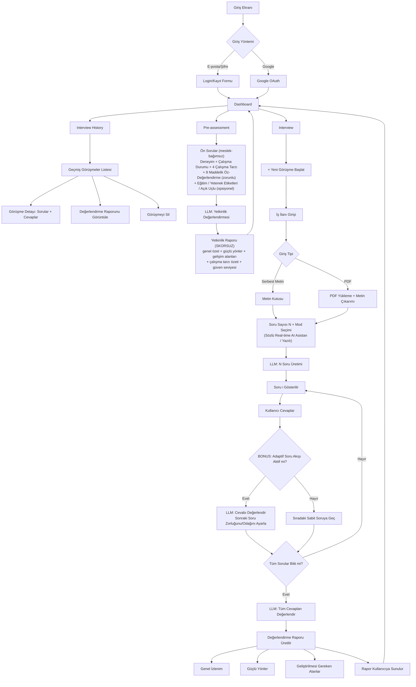
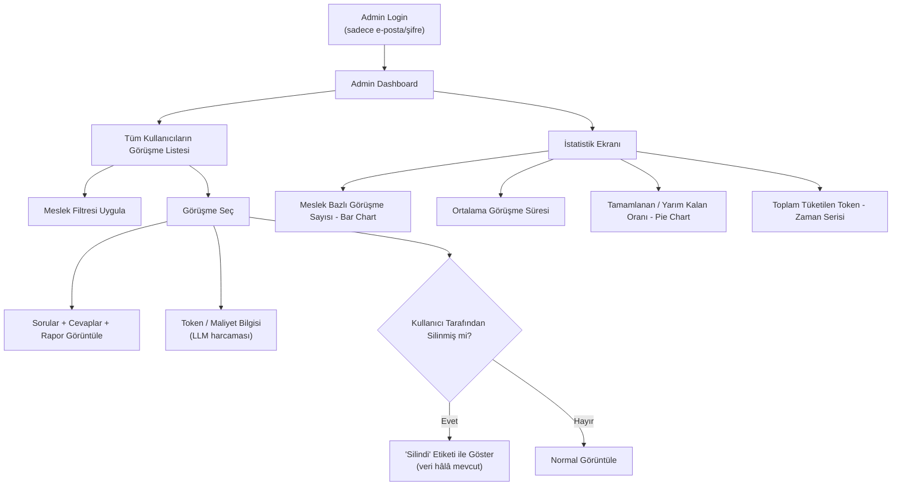
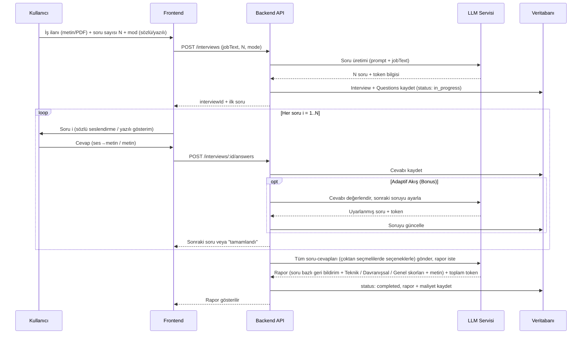

# Mock Interview Uygulaması — Akış Şeması (Taslak)

> **Güncelleme (2026-07-30, çapraz analiz):** Dikeyler arası uyumsuzluk taramasında bulunan
> bayat maddeler düzeltildi — pre-assessment raporunun **skorsuz** olması (§3.1, §5), sözlü
> mod altyapı kararı (ADR-0010) ve pre-assessment ↔ interview ilişkisinin **opsiyonel
> zenginleştirme** olarak netleşmesi. Teknoloji kararları için `DECISIONS.md`, dikeyler arası
> HTTP/veri sözleşmeleri için `API_CONVENTIONS.md` esastır.
>
> **Güncelleme (2026-08-04, meslek-bağımsızlık kararı):** Pre-assessment girdisi
> "ilgi alanı (frontend/backend/ml)" kavramından çıkarılıp **meslek-bağımsız** hale
> getirildi; deneyim seviyesi artık sorulmuyor, toplam çalışma deneyiminden **türetiliyor**
> (`003-pre-assessment` FR-002, FR-002d). Ayrıca rapor içeriğinin görüşme prompt'una context
> olarak geçirilmesi **Bonus'tan MVP'ye** yükseltildi (FR-016) ve `002-interview` tarafında
> **inşa edildi** (FR-030, Faz 15). Güncel alan tanımları için
> `specs/003-pre-assessment/spec.md` FR-002–FR-002d esastır.
>
> Bu doküman henüz **taslak** aşamasındadır. Amaç, kod yazmaya başlamadan önce ekranları, kullanıcı/admin akışlarını ve bonus özelliklerin (adaptif soru akışı, aday tanıma aşaması) nereye oturacağını netleştirmektir. Netleştikten sonra bu içerik `DECISIONS.md` içindeki "Mantıksal Tasarım Diyagramı" bölümüne taşınacaktır.
>
> **Güncelleme (2026-08-10, kod↔doküman senkronu):** İniş/tanıtım sayfası (`007-ui-design`)
> ve Ayarlar ekranı (dil + **açık/koyu tema** + **hesap silme**) ekran listesine (§4) ve UI
> notlarına (§6) eklendi. Onay kapısı `008-onay-akisi` (issue #71) ve tema/hesap-silme
> özellikleri artık kodda mevcut — detay için `docs/PROJECT_MAP.md` §5/§6/§8.

## 1. Kullanıcı Akışı (Ana Senaryo + Bonuslar)



**Kural:** Soru `i` tamamlanmadan soru `i+1` gösterilmez (zorunlu şart). Kullanıcı geri gidip cevap değiştiremez (varsayım — netleştirilecek).

## 2. Admin Akışı



## 3. Süreç Diyagramları — LLM Entegrasyonu (Sequence)

Okunabilirlik için süreç iki bağımsız akışa ayrılmıştır: **Pre-assessment** (adayı tanımaya yönelik meslek-bağımsız yetkinlik ölçümü, kullanıcı başına tek **aktif** rapor ama yeniden değerlendirilebilir — `003-pre-assessment` FR-009a) ve **Görüşme (Interview)**. Akışlar tetiklenme bakımından birbirinden bağımsızdır (pre-assessment'sız görüşme başlatılabilir); ancak aktif bir pre-assessment kaydı varsa raporu görüşme prompt'una **context olarak aktarılır** (FR-016/FR-030, uygulandı — bkz. §5).

### 3.1 Pre-assessment Süreci

```mermaid
sequenceDiagram
    participant U as Kullanıcı
    participant FE as Frontend
    participant BE as Backend API
    participant LLM as LLM Servisi
    participant DB as Veritabanı

    U->>FE: Ön soruları yanıtla (deneyim, çalışma durumu, çalışma tarzı, öz-değerlendirme + opsiyonel yetenek/açık uçlu)
    FE->>BE: POST /pre-assessments (experienceYears, workStatus, ... , selfRatings, skills?, openAnswers?)
    BE->>LLM: Yetkinlik değerlendirme isteği (şema: skor alanı YOK; experienceLevel türetilir, sorulmaz)
    LLM-->>BE: Niteliksel rapor (genel özet, güçlü yönler, gelişim alanları, çalışma tarzı özeti, güven seviyesi) + token
    BE->>DB: Raporu + TokenUsage kaydet (isActive=true, eski kayıt arşivlenir)
    BE-->>FE: Yetkinlik raporu gösterilir
```

> **Skorsuz rapor (bilinçli karar):** Pre-assessment raporunda **sayısal skor yoktur**
> (`003-pre-assessment` FR-006b, SC-010); şema fazladan alan gelirse reddeder. Kapalı-listeden
> gelen iki girdiden sayısal yetkinlik puanı üretmek yanıltıcı bir kesinlik iddiasıdır
> (Anayasa İlke VII — belirsizliği gizlememe). Yerine **güven seviyesi** (düşük/orta/yüksek)
> gösterilir.
>
> ⚠️ Bu, **görüşme** değerlendirme raporundan farklıdır: o rapor Teknik/Davranışsal/Genel
> eksenlerinde 0-100 skor içerir (`002-interview` FR-013) çünkü gerçek soru-cevap verisine
> dayanır. İki farklı varlıktır, çelişki değildir.
>
> **Pre-assessment ↔ Interview ilişkisi:** Görüşme başlatmak için pre-assessment **zorunlu
> değildir**. Aktif bir pre-assessment varsa iki zenginleştirme devreye girer: (1) yeni
> görüşme formundaki **seviye alanı ön-doldurulur** (`002-interview` FR-021), (2) raporun
> tam içeriği (özet, güçlü/gelişim alanları, çalışma tarzı özeti, öz-değerlendirme puanları,
> yetenek etiketleri) görüşme soru üretim prompt'una **context olarak verilir**
> (`003-pre-assessment` FR-016 — 2026-08-04 itibarıyla **Bonus'tan MVP'ye** yükseltildi ve
> `002-interview` tarafında inşa edildi, bkz. FR-030). Pre-assessment'ı olmayan kullanıcı
> görüşme başlatabilir; bu durumda context bloğu boş geçilir.

### 3.2 Görüşme (Interview) Süreci



## 4. Ekran Listesi (Özet Tablo)

| # | Ekran | Rol | Açıklama |
|---|-------|-----|----------|
| 1 | Login / Kayıt | Kullanıcı | E-posta/şifre veya Google girişi |
| 2 | Admin Login | Admin | Sadece e-posta/şifre |
| 3 | Dashboard | Kullanıcı | Üç sekme: Interview History / Pre-assessment / Interview |
| 4 | Interview History | Kullanıcı | Geçmiş görüşmeler listesi (kart görünümü) |
| 5 | Pre-assessment | Kullanıcı | Meslek-bağımsız ön sorular (deneyim, çalışma durumu, çalışma tarzı, öz-değerlendirme + opsiyonel eğitim/yetenek/açık uçlu) → yetkinlik raporu |
| 6 | Yeni Görüşme — İş İlanı Girişi | Kullanıcı | Serbest metin / PDF yükleme, soru sayısı N + mod seçimi (sözlü/yazılı) |
| 7 | Soru-Cevap Ekranı | Kullanıcı | Tek soru gösterimi, ilerleme çubuğu, "sıradaki" kilidi; sözlü (sesli AI asistan) veya yazılı |
| 8 | Değerlendirme Raporu | Kullanıcı | Teknik / Davranışsal / Genel skorları + metinsel geri bildirim + **soru bazlı geri bildirim** (her soru için doğru/kısmen/yetersiz, doğru cevap ve açıklaması — issue #68) |
| 9 | Görüşme Detayı (geçmiş) | Kullanıcı | Sorular, cevaplar, rapor; silme aksiyonu |
| 10 | Admin Dashboard | Admin | Tüm kullanıcılar/görüşmeler, meslek filtresi |
| 11 | Admin — Görüşme Detayı | Admin | Sorular, cevaplar, rapor, token/maliyet, "silindi" durumu |
| 12 | Admin — İstatistik Ekranı | Admin | Meslek bazlı sayılar, ortalama süre, tamamlanma oranı, token grafikleri |
| 13 | İniş / Tanıtım Sayfası | Ziyaretçi | Ürünü tanıtıp login/görüşme akışına yönlendiren landing (`007-ui-design`, `home.tsx`) |
| 14 | Ayarlar | Kullanıcı | Uygulama dili (TR/EN) + tema (açık/koyu) + hesap silme; oturumlar arası kalıcı, backend'e gitmez (`settings.tsx`) |

## 5. Alınan Kararlar (Şimdiye Kadar)

- ✅ Dashboard yapısı: **Üç sekme** — Interview History, Pre-assessment, Interview.
- ✅ Pre-assessment: **Bağımsız tetiklenir** — kendi yetkinlik raporunu üretir. Görüşme başlatmak için **zorunlu değildir**; aktif kayıt varsa iki zenginleştirme uygulanır: seviye alanının ön-doldurulması (`002-interview` FR-021) ve rapor içeriğinin görüşme prompt'una context olarak geçirilmesi (`003-pre-assessment` FR-016 — **MVP**, 2026-08-04'te Bonus'tan yükseltildi ve `002-interview` FR-030 ile inşa edildi).
- ✅ Pre-assessment yeniden değerlendirme: **Yapılabilir** — eski rapor silinmez, arşivlenir; kullanıcı başına tek **aktif** rapor (`003-pre-assessment` FR-004/009a). *(Önceki "tek seferlik" ifadesi clarify oturumunda güncellendi.)*
- ✅ Pre-assessment raporu **skorsuzdur** — sayısal puan yok, güven seviyesi var (FR-006b).
- ✅ Sözlü mod altyapısı: **Tarayıcı Web Speech API** (istemci tarafı STT + TTS) — **ADR-0010**. Maliyet sıfır, sunucuda ses işleme yok. Desteklemeyen tarayıcıda seçenek devre dışı gösterilir.
- ✅ Görüşme zorluk seviyesi: **Kullanıcı seçer** (`intern`/`junior`/`senior`) — pre-assessment varsa ön-doldurulur.
- ✅ Soru bazlı geri bildirim **yalnızca raporda** gösterilir, görüşme sırasında asla (issue #68).
  Anında gösterim adayın sonraki cevaplarını ve adaptif uyarlamayı kirletirdi; bu ürün bir
  **ölçüm** aracı, öğrenme aracı değil. Aynı gerekçe `interviewerRemark`'ın değerlendirme
  yapmasını da yasaklıyor (`contracts/interview-flow-rules.md` §4.2/§4.3). Değerlendirme
  **üç kademelidir** (doğru/kısmen/yetersiz) — açık uçlu cevaplar ikili ayrıma oturmaz.
- ✅ Üretim dili: **`Accept-Language`** başlığından çözümlenir (`tr`/`en`), görüşme kaydında saklanır (`API_CONVENTIONS.md` §4.2).
- ✅ Pre-assessment ön soruları: **Meslek-bağımsız** — zorunlu (deneyim süresi, çalışma durumu, 4 çalışma tarzı seçimi, 8 maddelik 1-5 öz-değerlendirme) + opsiyonel (eğitim durumu, yetenek etiketleri: serbest/önerili, 3 kısa açık uçlu soru). Deneyim seviyesi (`intern`/`junior`/`senior`) kullanıcıya sorulmaz, deneyim süresinden **türetilir** (`003-pre-assessment` FR-002/FR-002d).
- ✅ Görüşme modu: **Sözlü (real-time sesli AI asistan) veya yazılı** — soru sayısı seçimiyle **aynı ekranda** belirlenir.
- ✅ Bonus kapsamı: **Adaptif Soru Akışı** dahil.
- ✅ Soru tipi: **Karışık** — LLM, iş ilanı ve soru bağlamına göre çoktan seçmeli veya açık uçlu soru üretecek.
- ✅ PDF metin çıkarımı: **Backend'de (server-side)** yapılacak.
- ✅ Navigasyon: **Üst navbar** (sidebar yok).
- ✅ Destek kanalı: **tek e-posta adresi** (`support@smart-interview.me`), **iletişim formu YOK** (issue #51, 2026-08-05). Adres daima **görünür metin + `mailto:` linki** olarak sunulur; webmail kullanan (işletim sisteminde mail istemcisi tanımlı olmayan) kullanıcıda `mailto:` çalışmaz ama adres okunup kopyalanabilir. Form yolu bilinçli olarak seçilmedi: yeni bir uç nokta, oturumsuz istekler için spam/hız-sınırı koruması ve Resend günlük kotasının doğrulama mailleriyle paylaşılması anlamına gelirdi — kanal zaten çalışırken önüne ikinci bir katman koymak gerekmedi. Adresin tek doğruluk kaynağı `frontend/src/lib/support.ts`; i18n sözlükleri yalnızca çevresindeki metni taşır.
- ✅ Dashboard listeleme: **Kart (card) görünümü** — her görüşme bir kart; pozisyon, tarih, durum rozeti içerir.
- ✅ Soru-cevap ekranı: **Chat/mesajlaşma tarzı arayüz** — soru ve cevaplar sohbet balonları şeklinde akar.
- ✅ Çoktan seçmeli görünüm: **Dikey tıklanabilir liste** (seçenekler alt alta).
- ✅ Admin görsel ayrımı: **Aynı layout, beyaz arkaplan + açık mavi vurgu** (kullanıcı panelinden ayırt edilmesi için).
- ✅ Rapor görselleştirmesi: **Teknik / Davranışsal / Genel** olmak üzere 3 sabit eksen + metin + grafik (radar/bar chart).
- ✅ Teknoloji stack ve LLM sağlayıcı: **karara bağlandı** — `TECH_STACK.md` + `DECISIONS.md` (ADR-0001…0012). Google login: Better Auth (ADR-0003).
- ✅ Kalan teknik kararların tamamı kapandı: PDF metin çıkarma **unpdf** (ADR-0009), grafik kütüphanesi **Recharts** (ADR-0011), mail gönderim yolu **Resend** (ADR-0008). İstemci tarafı PDF üretimi **jsPDF** (ayrı ADR açılmadı — `specs/004-history/research-pdf-karar.md`).

## 6. UI Notları (Güncel Kararlara Göre)

- **Alt bilgi (footer):** Her sayfada aynı — telif satırı + destek adresi (kopyala butonuyla). `AppShell`, `AdminShell` ve iniş sayfasına eklenir; iniş sayfası koyu zeminde bittiği için orada koyu varyantı kullanılır. Destek adresi ayrıca üç yerde daha çıkar: **Ayarlar** sayfasında "Destek" kartı, **hata ekranlarında** ("tekrar dene" işe yaramazsa kullanıcının tek yolu kalmasın — `ErrorRetry`, `ReportFailed`, `GenerationError`) ve **auth kartının altında** (giriş yapamayan kullanıcı kilitlenmesin).
- **Üst Navbar öğeleri (kullanıcı):** Logo | Interview History | Pre-assessment | Interview | (sağda) Kullanıcı menüsü / çıkış
- **Üst Navbar öğeleri (admin):** Logo (açık mavi vurgu) | Kullanıcılar/Görüşmeler | İstatistikler | (sağda) Admin menüsü / çıkış
- **Dashboard sekmeleri:**
  - **Interview History:** Geçmiş görüşmeler kart görünümünde listelenir.
  - **Pre-assessment:** Meslek-bağımsız ön soru formu → yetkinlik raporu; yeniden değerlendirme yapılabilir (eski kayıt arşivlenir, tek aktif kayıt kalır).
  - **Interview:** Yeni görüşme başlatma akışı.
- **Dashboard kartı içeriği:** Pozisyon adı, oluşturulma tarihi, durum rozeti (Tamamlandı / Yarım Kaldı / Silindi — kullanıcıda silindiyse liste dışı), "Raporu Gör" / "Sil" aksiyonları
- **Pre-assessment formu:** Meslek-bağımsız zorunlu alanlar (deneyim süresi, çalışma durumu, 4 çalışma tarzı seçimi, 8 maddelik öz-değerlendirme ölçeği) + opsiyonel alanlar (eğitim durumu, yetenek etiketleri, 3 açık uçlu soru); sonuç ekranında skorsuz yetkinlik raporu gösterilir.
- **Yeni görüşme girişi:** İş ilanı (metin/PDF) + soru sayısı N + **mod seçimi (sözlü / yazılı)** aynı ekranda; ardından doğrudan soru üretimine geçilir.
- **Soru-cevap ekranı (chat tarzı):**
  - Sistem/asistan balonu → soru metni (çoktan seçmeliyse seçenekler balon altında **dikey tıklanabilir liste** olarak)
  - Kullanıcı balonu → verilen cevap (yazılı modda metin; sözlü modda sesli asistan + metne dökülmüş cevap)
  - Üstte ilerleme göstergesi (örn. "Soru 3/8") sohbet akışıyla birlikte sabit kalabilir
  - Aktif soru cevaplanmadan bir sonraki soru balonu görünmez (kilit kuralı korunur)
- **Rapor ekranı:** Üstte genel skor, altında **Teknik / Davranışsal / Genel** eksenli grafik (radar veya bar chart), en altta metinsel "Genel İzlenim / Güçlü Yönler / Gelişim Alanları" blokları.
- **Tema (açık/koyu):** Ayarlar sayfasından değiştirilir; iki seçenek (`light`/`dark`, "sistemi takip et" yok). Tercih `localStorage`'da tutulur, backend'e gitmez (dil seçimiyle aynı desen). Form doldururken tema değiştirmek girilen veriyi kaybettirmez (`<html data-theme>` özniteliği güncellenir, ağaç yeniden mount edilmez).
- **Ayarlar sayfası:** Uygulama dili (TR/EN) + tema seçimi + "Destek" kartı + **hesap silme** onay diyaloğu (`DELETE /api/users/me`).

## 7. Netleştirilmesi Gereken Noktalar

Bu bölüm, sohbet üzerinden birlikte karar verdikçe güncellenecektir.

- [x] ~~Google login altyapısı~~ → Better Auth (ADR-0003)
- [x] ~~Teknoloji stack kararı~~ → `TECH_STACK.md` (ADR-0001, 0002, 0004, 0005)
- [x] ~~LLM sağlayıcı kararı~~ → Groq birincil + DeepSeek yedek (ADR-0007)
- [x] ~~Sözlü mod altyapısı~~ → tarayıcı Web Speech API (ADR-0010)
- [x] ~~Rapor kategori skorları~~ → **Görüşme raporu:** Teknik / Davranışsal / Genel, 0-100 (`002-interview` FR-013). **Pre-assessment raporu:** skor yok (FR-006b).
- [x] ~~Grafik kütüphanesi hangisi olacak?~~ → **Recharts**, shadcn/ui `Chart` üzerinden (ADR-0011, kabul 2026-07-31)
- [x] ~~Mail gönderim yolu~~ → **Resend**; geliştirmede `MAIL_TRANSPORT=console` (ADR-0008, kabul 2026-07-31)
- [x] ~~Çoktan seçmeli sorularda seçenekler chat balonunda nasıl gösterilecek?~~ → **Dikey tıklanabilir liste** (§5 kararı; `frontend/src/components/interview/question-card.tsx`)
- [x] ~~Admin renk teması ne olacak (örn. koyu lacivert yerine gri/mor tonlar)?~~ → **Açık mavi-camgöbeği vurgu** (`--color-admin-accent: #0e7490`, `-strong: #155e75`, `-soft: #e0f2fe`; `frontend/src/index.css`). Aynı beyaz zemin + aynı yerleşim korunur; yalnızca vurgu rengi değişir (§5 kararı, `005-admin` FR-015). `AdminShell` bu ağaçta `--color-accent`'i admin token'ına yeniden bağlar, böylece `Logo` dahil accent kullanan alt bileşenler **değiştirilmeden** admin temasına geçer. *(2026-08-04, `005-admin` implementasyonu — tek accent token'ının kullanıcı paneliyle aynı olduğu ve FR-015'i karşılamadığı `/speckit-analyze` bulgusu U2 ile tespit edildi.)*
