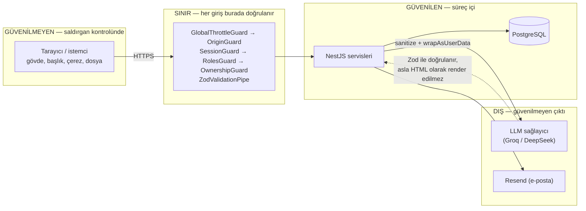

# SECURITY.md — Güvenlik Analizi ve İyileştirme Planı

> Bu doküman, projenin güvenlik duruşunu kayıt altına alır: neyin doğru kurulduğunu,
> hangi boşlukların açık kaldığını ve bunların hangi sırayla kapatılacağını.
> Kapsam, case study brief'indeki **"Uygulama Mimarisi ve Tasarımı → Güvenlik"**
> kriteridir (issue #64).
>
> **Otorite sınırı:** Bu dosya teknoloji seçim kaydının yerine geçmez —
> güvenlikle ilgili bir _karar_ alınırsa ADR olarak [`DECISIONS.md`](DECISIONS.md)'ye
> yazılır, buraya yalnızca bulgu ve plan girer. Uç nokta sözleşmeleri
> [`API_CONVENTIONS.md`](API_CONVENTIONS.md)'de kalır.

**Analiz tarihi:** 2026-08-06 · **Analiz edilen sürüm:** `4847b01` (main)

---

## 1. Yöntem

Analiz üç kaynaktan yürütüldü:

1. **Kod grafiği** — repo bilgi grafiğine indekslendi (4548 düğüm / 7745 kenar);
   guard zincirleri, çağrı yolları ve rota tanımları grafik üzerinden izlendi.
2. **Hedefli okuma** — kimlik doğrulama, yetkilendirme, giriş doğrulama, LLM
   prompt kurulumu, dosya yükleme ve hata işleme yolları uçtan uca okundu.
3. **Doğrulama** — bulguların her biri kaynak dosya ve satır numarasıyla
   sabitlendi; teorik olan ile fiilen sömürülebilir olan ayrı işaretlendi.

Kapsam **uygulama katmanıdır**. Altyapı sertleştirmesi (TLS sonlandırma, WAF,
ağ politikaları) bu dokümanın dışındadır — deployment topolojisi kararı
verildiğinde ayrıca ele alınır.

---

## 2. Özet değerlendirme

Güvenlik kriteri **büyük ölçüde karşılanıyor.** Mimari doğru kurgulanmış:
yetkilendirme sunucuda ve merkezî, kullanıcı verisi LLM'e giderken izole
ediliyor, hata yanıtları iç durumu sızdırmıyor, tarayıcıda token tutulmuyor.
Bunlar sonradan eklenen yamalar değil, baştan kurulmuş kararlar.

Açık kalan boşluklar tasarımın kendisinde değil, **kenar noktalarındaydı**:
geliştirme kolaylığı için açılmış bir kapı üretime kapatılmadan taşınıyor,
hız sınırı refleksi bir uç noktada uygulanmamış ve taşıma katmanı hiç
yapılandırılmamış. Bir tanesi (S1) üretimde hesap ele geçirmeye açıktı.

| Önem | Adet | Durum |
|------|:----:|-------|
| Kritik | 1 | ✅ kapatıldı |
| Yüksek | 2 | ✅ kapatıldı |
| Orta | 4 | 3 ✅ kapatıldı · 1 ⚠️ kabul edilmiş risk (S7) |
| Düşük | 5 | ✅ kapatıldı |

**Güncel durum (Faz 1-4 tamamlandı).** On iki bulgunun on biri kapatıldı;
S7 bilinçli bir ürün kararı olduğu için kaldırılmadı, hız sınırıyla
pahalılaştırıldı ve artık kalan risk açıkça kayda geçirildi. Her bulgunun bir
regresyon testi vardır (§6 envanter), böylece düzeltmeler ileride sessizce
geri alınamaz. Kabul edilen riskler §5.4'te toplanmıştır.

---

## 3. Doğru kurulmuş olan

Aşağıdakiler analizde **bulgu üretmedi**; kayda geçiriliyor çünkü güvenlik
duruşunun taşıyıcı kısmı bunlardır ve ileride bir değişiklik bunları bozarsa
buradan fark edilmelidir.

| Alan | Durum |
|------|-------|
| **Prompt injection izolasyonu** | `sanitizeFreeText()` sınırlayıcı taklidi dizileri (`</?etiket>`) ve C0 kontrol karakterlerini temizler; `wrapAsUserData()` kullanıcı metnini ayrı etiket bloğuna alır. Koruma tek bir etiket adına değil **jenerik etiket desenine** karşıdır — `002-interview` ve `003-pre-assessment` bloklarını farklı etiket adlarıyla kullandığı için bu bilinçli bir genellemedir. |
| **Yetkilendirme zinciri** | Her controller sınıf seviyesinde `SessionGuard`; admin uçları ek olarak `RolesGuard`; görüşme kaynakları `InterviewOwnershipGuard`. Ön değerlendirme sahiplik kontrolü serviste (`findOne`). Guard'sız uç nokta yok. |
| **Rol yükseltme** | `role` alanı Better Auth'ta `input: false` — istemci kayıt gövdesinde rol gönderemez. `request.user.role` istemciden değil, DB destekli oturumdan doldurulur. |
| **IDOR / varlık sızıntısı** | Yabancı kayıt `403` değil **`404`** döner; gerekçe kodda yazılıdır (403 kaydın var olduğunu sızdırır, id denemesiyle başkasının kayıt sayısı çıkarılabilir). Soft-delete edilmiş kayıt sahibi için "yok" ile ayırt edilemez. |
| **Admin salt-okunurluğu** | `InterviewOwnershipGuard` admin'e okuma izni verir ama başkasının kaydına **yazmayı** reddeder; `/api/admin/*` altında hiç yazma rotası tanımlı değildir. |
| **Hata zarfı** | `HttpExceptionFilter` stack trace, SQL, dosya yolu ve sağlayıcı yanıtı sızdırmaz. Beklenmeyen hata sunucu logunda kalır, istemciye jenerik mesaj gider — sessiz yutma da yoktur. |
| **Oturum saklama** | Tarayıcıda token yoktur. `localStorage` yalnızca tema ve dil tercihi tutar. Oturum httpOnly çerezdedir. |
| **Şifre sıfırlama** | Enumeration-safe (kayıtlı/kayıtsız aynı yanıt), tek kullanımlık, 1 saat geçerli, eski token'lar silinir, sıfırlama sonrası kullanıcının **tüm oturumları iptal edilir**. |
| **Admin + Google reddi** | Üç ayrı akışta bağımsız olarak kapatılmıştır: id-token ile giriş, One Tap callback ve oturum oluşturma hook'u. |
| **Sırlar** | Takip edilen dosyalarda sır yoktur; `.env` gitignore'dadır, yalnızca yer tutuculu `.env.example` versiyonlanır. |
| **PDF girişi** | MIME kontrolü + boyut kontrolü + çıkarılan metne 40.000 karakter tavanı (uzun PDF'in prompt'u taşırmasına karşı). |
| **CORS** | Tek origin (`FRONTEND_URL`), `credentials: true` ile birlikte joker kullanılmaz. |
| **XSS** | Tek `dangerouslySetInnerHTML` kullanımı (`ui/chart.tsx`) statik grafik yapılandırmasından renk değişkeni yazar; kullanıcı verisi geçmez. LLM çıktısı React tarafından kaçışlanarak render edilir. |

---

## 4. Bulgular

Her bulgu şu alanlarla kayıtlıdır: önem, konum, kanıt, düzeltme.

### S1 — Tünel joker host'u üretimde hesap ele geçirmeye açık · **KRİTİK**

**Konum:** `backend/src/auth/better-auth.config.ts` (baseURL yapılandırması)

**Kanıt.** `baseURL.allowedHosts` içinde `*.trycloudflare.com` **koşulsuz** tanımlıdır;
geliştirme/üretim ayrımı yoktur. Kodun kendi yorumu ikinci etkiyi de belirtir:
joker, `trustedOrigins`'e de otomatik eklenir.

**Etki.** Uygulama üretimde yayındayken:

1. Saldırgan ücretsiz bir Cloudflare quick tunnel açar (`saldirgan-xyz.trycloudflare.com`).
2. Backend'e `POST /api/auth/request-password-reset` isteğini `Host: saldirgan-xyz.trycloudflare.com`
   başlığıyla ve gövdede **kurbanın** e-postasıyla gönderir.
3. Better Auth baseURL'i Host başlığından çözer (joker eşleşir) ve sıfırlama
   bağlantısını saldırganın origin'i ile kurar.
4. Kurbanın gerçek posta kutusuna, saldırganın alan adına giden bir sıfırlama
   bağlantısı düşer.
5. Kurban bağlantıya tıkladığında tek kullanımlık token saldırgana gider → **hesap devralınır.**

Aynı yol `sendVerificationEmail` için de açıktır. Joker `trustedOrigins`'e de
girdiğinden Better Auth'un kendi origin kontrolü o alan adı için gevşer.

**Neden böyle olmuş.** Tünel desteği geliştirme kolaylığı için eklendi ve o
bağlamda doğru bir tercihti (rastgele tünel adresi her açılışta değişir,
`.env` düzenlemeden çalışması isteniyordu). Eksik olan, bu kapının üretimde
kapatılması.

**Düzeltme.** Davranışı local'de aynen koruyacak biçimde bayrağa bağla:

```ts
const tunnelEnabled = process.env.ALLOW_TUNNEL_HOSTS === 'true';

baseURL: tunnelEnabled
  ? { allowedHosts: ['*.trycloudflare.com'], protocol: 'auto', fallback: localBaseURL }
  : localBaseURL,
```

`ALLOW_TUNNEL_HOSTS` `env.validation.ts`'e varsayılanı `false` olacak şekilde
eklenir ve `.env.example`'da tünel senaryosu için belgelenir.

---

### S2 — Hesap silme ucunda sınırsız parola denemesi · **YÜKSEK**

**Konum:** `backend/src/users/users.service.ts` → `deleteAccount()`,
`backend/src/users/users.controller.ts` → `DELETE /api/users/me`

**Kanıt.** Uç nokta `verifyPassword()` çağırır ve önünde hiçbir hız sınırı yoktur.
Yanıtlar ayırt edilebilir: yanlış şifre `401`, doğru şifre `204`.

**Etki.** Ele geçirilmiş ya da ortak makinede açık bırakılmış bir oturum çerezinde
uç nokta sınırsız parola tahmin oracle'ına dönüşür. Doğru tahminin bedeli geri
alınamaz hesap silmedir (tam silme, cascade).

**Not.** Projenin kendi standardı bunu zaten karşılıyor: `sign-in/email` için
10 başarısız deneme / 15 dk, `request-password-reset` için 3 istek / saat.
Refleks bu uç noktada uygulanmamış.

**Düzeltme.** `rate-limit.config.ts` içindeki mevcut sayaç deseni yeniden
kullanılır (ayrı eşik, ayrı Map — iki güvenlik politikası karıştırılmaz).

---

### S3 — Global hız sınırı yok · **YÜKSEK**

**Konum:** `backend/src/app.module.ts`, `backend/src/interview/interview.module.ts`

**Kanıt.** `ThrottlerModule.forRoot` yalnızca `interview.module.ts`'te ve sadece
`'llm'` isimli kova ile kayıtlıdır. LLM maliyeti taşımayan uçların hiçbirinde
sınır yoktur: `/api/admin/stats` (çağrı başına dört ayrı agregasyon),
`/api/admin/interviews`, `/api/interviews` (GET), `/api/pre-assessments` (GET),
`/api/users/me`.

**Etki.** Tek kaynaktan ucuz kaynak tüketimi; özellikle istatistik ucu her
istekte veritabanında dört sorgu koşar.

**Düzeltme.** `app.module.ts`'te varsayılan bir kova + `APP_GUARD` kaydı.
LLM kovası isimli olarak ayrı kalır, mevcut `@Throttle(llmQuota(n))`
kullanımları değişmez.

---

### S4 — Yükleme boyut limiti multer katmanında yok · **ORTA**

**Konum:** `backend/src/interview/interview.controller.ts` (`FileInterceptor`),
`backend/src/pdf/pdf-extraction.service.ts`

**Kanıt.** `PDF_MAX_SIZE_MB` kontrolü **servis katmanındadır**, yani multer dosyayı
tamamen belleğe aldıktan sonra çalışır. `FileInterceptor` bir `limits` seçeneği
almaz.

**Etki.** 500 MB'lık bir istek önce RAM'e yazılır, sonra reddedilir. Eşzamanlı
birkaç istek süreci düşürebilir.

**Düzeltme.**

```ts
@UseInterceptors(
  FileInterceptor('jobPostingFile', {
    limits: { fileSize: 10 * 1024 * 1024 },
  }),
)
```

Sınır `PDF_MAX_SIZE_MB` ile aynı kaynaktan okunmalı ki iki yerde ayrışmasın.

---

### S5 — CSRF savunması örtük bir varsayılana yaslı · **ORTA** (bugün sömürülebilir değil)

**Konum:** `backend/src/auth/better-auth.config.ts` (çerez yapılandırması yok),
`interview` / `pre-assessment` / `users` / `admin` controller'ları

**Kanıt.** Better Auth kendi `/api/auth/*` rotalarını `trustedOrigins` ile korur.
Ancak `/api/interviews`, `/api/pre-assessments`, `/api/users/me` ve `/api/admin/*`
NestJS tarafında yazılmış, **çerezle kimliklenen** uçlardır ve bunlarda ne CSRF
token'ı ne de origin kontrolü vardır.

**Etki.** Şu an sömürülebilir değildir: Better Auth'un varsayılan `sameSite: lax`
çerezi siteler arası POST/DELETE isteğinde gönderilmez ve CORS tek origine
kapalıdır. Sorun, bu korumanın **kodda hiçbir dayanağının ve dokümanda hiçbir
kaydının olmaması**. Ayrı alan adına deploy için çerez `sameSite: 'none'`
yapıldığı anda (split-domain topoloji bunu gerektirir) bu uçların tamamı CSRF'e
açılır ve değişikliği yapan kişinin bunu fark etmesi için bir işaret yoktur.

**Düzeltme.** İki adım, sırayla:

1. Çerez duruşunu `advanced.defaultCookieAttributes` ile **açıkça** yapılandır —
   varsayılana güvenme.
2. Eğer topoloji kararı `sameSite: 'none'` gerektiriyorsa, özel uçlara origin
   kontrolü veya CSRF token'ı ekle. Tek-origin seçilirse bu adım gerekçesiyle
   birlikte kapatılır.

Karar ADR olarak kaydedilmelidir — bu bir tercih, tek doğru cevabı yok.

---

### S6 — Güvenlik başlıkları yok · **ORTA**

**Konum:** `backend/src/main.ts`

**Kanıt.** Bootstrap 15 satırdır: global exception filter + CORS. `helmet` yoktur.
`X-Content-Type-Options`, `X-Frame-Options`, `Referrer-Policy` ve HSTS
gönderilmez.

**Etki.** API-only bir yüzey olduğu için doğrudan etki sınırlıdır, ancak
`Referrer-Policy` yokluğu doğrulama/sıfırlama bağlantılarındaki token'ın dış
sitelere referrer başlığıyla sızmasına zemin hazırlar.

**Düzeltme.** `helmet()` middleware'i; API için CSP kapalı bırakılabilir.

---

### S7 — Kayıt akışında enumeration ve sağlayıcı sızıntısı · **ORTA**

**Konum:** `backend/src/auth/hooks/sign-up.hook.ts`

**Kanıt.** Akış üç ayırt edilebilir yanıt üretir:

| Durum | Yanıt |
|-------|-------|
| E-posta kayıtlı, parola hesabı var | `409 ACCOUNT_EXISTS` |
| E-posta kayıtlı, yalnızca Google | `403 ACCOUNT_USE_GOOGLE` |
| E-posta kayıtsız | başarı |

**Etki.** Saldırgan hangi e-postaların kayıtlı olduğunu **ve hangi sağlayıcıyla**
kayıtlı olduğunu tarayabilir. İkincisi hedefli kimlik avı için doğrudan
kullanışlı bilgidir.

**Not.** Sıfırlama akışında enumeration'a karşı özenle çalışılmışken (kayıtlı ve
kayıtsız e-posta aynı yanıtı alır, sayaç bile ayrım yapmadan işletilir) kayıt
akışının aynı çıtayı tutmaması tutarsızdır. Kayıt akışında "bu e-posta zaten
alınmış" bilgisini vermek yaygın ve savunulabilir bir takastır; asıl gereksiz
olan **sağlayıcı ayrımıdır**.

**Karar: kabul edilmiş risk + azaltma.** İlk önerim ayrımı yanıttan kaldırmaktı.
Uygulamadan önce görüldü ki bu davranış **bilinçli olarak kararlaştırılmış ve
puanlanan bir kabul kriteridir**:

| Kaynak | İçerik |
|--------|--------|
| `specs/001-auth-rol/spec.md` Hikâye 3 kriter 3 | Uyarı gösterilir, kullanıcı Google girişine yönlendirilir |
| `spec.md` Netleştirme (S/K) | Enumeration ile kayıt-özel bilgilendirme **açıkça tartılmış**; sınır sign-in'de çizilmiş |
| `tasks.md` T073 | Bu çelişkiyi karara bağlamak için ayrı görev açılmış ve kapatılmış |
| `contracts/auth-api.md` | `403` + `ACCOUNT_USE_GOOGLE` sözleşmede sabit |
| `degerlendirme-user-stories.md` DS-03-E1 | ✅ işaretli değerlendirme kriteri |

Sızıntı **giriş** yolunda zaten yok (FR-014/SC-007 gereği her zaman genel `401`);
yalnızca **kayıt** yolundadır ve "bu e-posta zaten alınmış" bilgisini vermek
kayıt akışlarında yaygın, savunulabilir bir takastır.

Bu yüzden ayrım kaldırılmadı, **pahalılaştırıldı**: Better Auth'un yerleşik
`rateLimit.customRules` mekanizmasıyla `/sign-up/email` ucuna **IP başına saatte
40 deneme** sınırı kondu.

Eşik, meşru kullanımın hiçbir zaman yaklaşmayacağı ama otomatik taramanın
anlamsızlaşacağı aralıkta seçildi: normal bir kullanıcı hayatı boyunca bir kez
kayıt olur, paylaşılan bir IP'nin (ofis, üniversite, mobil NAT) arkasından aynı
saatte onlarca gerçek kayıt gelmesi ise olağandır. Daha sıkı bir değer, tarayıcıyı
biraz daha yavaşlatmanın karşılığında gerçek kullanıcıları engelleme riskini
büyütürdü.

**Artık kalan risk (kabul edilmiş):** hedefli tekil sorgu hâlâ mümkündür —
saldırgan belirli bir adresi merak ediyorsa öğrenebilir. Sınır, kütle taramasının
maliyetini yükseltir; tekil sorguyu engellemez.

**Yan bulgu — düzeltildi.** Aynı fonksiyondaki `include: { accounts: true }`
sorgusu parola hash'lerini gereksiz yere belleğe çekiyordu; `select` ile
yalnızca `providerId` okunacak şekilde daraltıldı.

---

### S8 — Loglarda kişisel veri · **DÜŞÜK**

**Konum:** `backend/src/auth/better-auth.config.ts` (sıfırlama akışı log satırları)

**Kanıt.** Kullanıcı e-postası düz metin loglanır
(`[reset] Sifirlama baglantisi gonderildi: ${user.email}`).

**Etki.** Proje KVKK aydınlatma metni, onay akışı ve unutulma hakkı (hesap silme)
taşıyor; log tarafında aynı titizlik yok. Hesap silindiğinde kişisel veri
veritabanından düşer ama loglarda kalmaya devam eder.

**Düzeltme.** E-posta yerine kullanıcı id'si loglanır. Güvenlik olayının kayıt
altına alınması amacı (FR-012) id ile de karşılanır.

---

### S9 — Admin seed parolası politika dışı · **DÜŞÜK**

**Konum:** `backend/prisma/seed.ts`, `backend/src/config/env.validation.ts`

**Kanıt.** `passwordPolicy` (en az 8 karakter, en az bir harf **ve** bir rakam)
kayıt ve şifre sıfırlama akışlarında zorunludur. `seed.ts` `ADMIN_PASSWORD`'ü
doğrudan hash'ler; `env.validation.ts` yalnızca `min(8)` ister.

**Etki.** Sistemin en yetkili hesabı, sıradan kullanıcıdan daha gevşek kurala
tabidir — `aaaaaaaa` kabul edilir.

**Düzeltme.** `env.validation.ts` içinde `ADMIN_PASSWORD` alanı `passwordPolicy`
ile doğrulanır. Tek kaynak zaten `hooks/password-policy.ts`'te durmaktadır.

---

### S10 — Dosya türü istemci beyanına güveniyor · **DÜŞÜK**

**Konum:** `backend/src/pdf/pdf-extraction.service.ts`

**Kanıt.** `extractText(buffer, mimeType)` multipart part'ının `Content-Type`
değerine güvenir; bu değer istemci tarafından belirlenir ve sahtelenebilir.

**Etki.** Sınırlı — PDF olmayan içerik `unpdf` tarafından zaten reddedilir ve
`422` döner. Yine de tür kontrolü içerik yerine beyana dayanıyor.

**Düzeltme.** Tampon başındaki `%PDF-` sihirli baytı kontrol edilir (tek satır).

---

### S11 — `trust proxy` ayarlanmamış · **DÜŞÜK**

**Konum:** `backend/src/main.ts`

**Kanıt.** Express `trust proxy` ayarı yapılmamıştır.

**Etki.** Ters vekil arkasında `req.ip` vekilin IP'sini döner.
`LlmRateLimitGuard` oturumsuz istek için IP'ye düşen bir yedek anahtar
kullanır — bu anahtar tüm kullanıcılar için tek ortak kovaya dönüşür.

**Düzeltme.** Deployment topolojisi belirlendiğinde `app.set('trust proxy', 1)`
(vekil sayısına göre). Topoloji kararına bağlı olduğu için Faz 2'ye alınmıştır.

**Güncelleme (2026-08-19).** `TRUST_PROXY` eklendi ama varsayılanı `0`'dır ve
üretimde yazılmazsa sessiz bir arıza bırakıyordu: ters vekil arkasında IP başına
çalışan `default` kovası (300/60 sn) **tüm kullanıcılar için tek ortak kovaya**
dönüşür — normal trafikte bile 429 üretir. Artık `NODE_ENV=production` iken
`TRUST_PROXY` **açıkça** yazılmamışsa uygulama açılmaz (`env.validation.ts`).
Değerin kendisi serbesttir: vekil yoksa `TRUST_PROXY=0` yazmak geçerli bir
cevaptır — istenen tek şey kararın varsayılana bırakılmamasıdır.

---

### S12 — Hız sınırı sayaçları sınırsız büyüyor · **DÜŞÜK**

**Konum:** `backend/src/auth/rate-limit.config.ts`

**Kanıt.** Sayaçlar süreç içi `Map`'lerde tutulur. Kodda `ponytail:` yorumuyla
zaten belgelenmiştir: çok-örnekli dağıtımda paylaşılmaz, yeniden başlatmada
sıfırlanır, eski kayıtlar temizlenmez.

**Etki.** Süresi dolmuş kayıt yalnızca **aynı e-posta tekrar denendiğinde**
silinir. Rastgele e-postalarla istek üreterek bellek şişirilebilir.

**Düzeltme.** Periyodik temizlik ya da sınırlı boyut (LRU). Ölçek gerekirse
TTL destekli bir depoya (Redis) taşıma yolu kodda not edilmiştir.

---

## 5. Tehdit modeli ve güven sınırları

Bulguların hangi zemine oturduğunu sabitler: sistemde neye güvenildiğini, neye
güvenilmediğini ve hangi saldırganın varsayıldığını.

### 5.1 Güven sınırları



### 5.2 Varsayılan saldırgan

| Yetenek | Var mı | Sonuç |
|---------|:------:|-------|
| İstek gövdesini, başlıkları, çerezleri, dosyaları serbestçe üretmek | ✅ | Tüm doğrulama **sunucuda** (Anayasa İlke V); istemci kontrolü atlatılabilir kabul edilir |
| Kendi hesabını açmak ve oturum almak | ✅ | Yetkilendirme kaynak sahipliğine göre; `404` ile varlık gizlenir |
| Kurbana bağlantı tıklatmak / kötü niyetli sayfa barındırmak | ✅ | CSRF (`OriginGuard`), `Host` başlığı zehirlemesi (S1) bu yüzden kapatıldı |
| İş ilanı / cevap metnine talimat gömmek | ✅ | Prompt injection izolasyonu: `sanitizeFreeText` + `wrapAsUserData` |
| Kurbanın posta kutusunu okumak | ❌ | Doğrulama ve sıfırlama bağlantıları tek kanal olarak e-postaya güvenir |
| Sunucu sürecine veya veritabanına doğrudan erişmek | ❌ | Kapsam dışı; sızması hâlinde `BETTER_AUTH_SECRET` ile birlikte her şey düşer |
| TLS'i kırmak / ağı dinlemek | ❌ | Taşıma güvenliği altyapı katmanının sorumluluğu |

### 5.3 Neye güvenilmez

- **İstemcinin gönderdiği rol.** `role` alanı `input: false`; `request.user.role`
  daima DB destekli oturumdan doldurulur.
- **İstemcinin beyan ettiği dosya türü.** `Content-Type` ucuz ön elemedir; tür
  içerikten doğrulanır (S10).
- **`Host` başlığı.** Üretimde `baseURL` sabittir; `Host`'tan çözme yalnızca
  `ALLOW_TUNNEL_HOSTS` açıkken (S1).
- **`X-Forwarded-For`.** Yalnızca `TRUST_PROXY` > 0 iken dikkate alınır (S11).
- **LLM çıktısı.** Zod ile doğrulanır; React tarafından kaçışlanarak render
  edilir, hiçbir yerde HTML olarak yorumlanmaz.
- **Çerezin `SameSite` varsayılanı.** `OriginGuard` bu değerden bağımsız olarak
  ikinci katmanı sağlar (S5, [ADR-0012](DECISIONS.md)).

### 5.4 Kabul edilen riskler

| Risk | Neden kabul edildi |
|------|--------------------|
| Kayıt akışında hesap varlığı ve sağlayıcı öğrenilebilir | Puanlanan kabul kriteri (DS-03-E1); kütle taraması hız sınırıyla pahalılaştırıldı — S7 |
| Yüklenen PDF'ten çıkarılan metin ≤1 sa. süreç belleğinde tutulur | Çıkarım önbelleği (C5) anahtarı **içeriğin SHA-256'sı**dır: aynı anahtar ancak baytlar birebir aynıysa oluşur, dolayısıyla bir kullanıcının metnini başkasına döndürmesi mümkün değildir. Veri diske yazılmaz, süreç yeniden başlayınca kaybolur; kalıcı depolamadaki (`Interview.jobPostingText`) süre bundan zaten uzundur |
| `@nestjs/throttler` sayaçları `REDIS_URL` verilmezse çok-örnekli dağıtımda paylaşılmaz | Artık **yapılandırma kararı**: `REDIS_URL` verilirse sayaçlar örnekler arasında paylaşılır ve yeniden başlatmaya dayanır (`common/throttler-storage.ts`). Boş bırakmak tek-örnekli kurulumda geçerli bir seçimdir; hangi yolun seçildiği açılışta loglanır |
| Auth sayaçları (giriş denemesi, sıfırlama isteği, hesap silme) hâlâ süreç-içi | `rate-limit.config.ts` senkron bir API sunar ve Better Auth kancalarından çağrılır; Redis'e taşımak bu güvenlik yolunu asenkrona çevirmeyi gerektirir. Ayrı bir adım olarak bırakıldı — throttler kovaları paylaşımlıyken bunlar değil |
| `Origin` başlığı olmayan istek geçer | Tarayıcı dışı istemcilerde CSRF kavramı yoktur; zorunlu kılmak yalnızca meşru istemcileri kırardı — [ADR-0012](DECISIONS.md) |
| Geliştirmede doğrulama bağlantısı konsola düz yazılır | Yalnızca `MAIL_TRANSPORT="console"` yolunda; üretimde o satırlara hiç ulaşılmaz — S8 |

**Denenip geri alındı — oturum çerez önbelleği (2026-08-21).** Better Auth'un
`session.cookieCache` ayarı, oturumu imzalı çerezde tutup her istekteki
session+user sorgusunu kaldırıyordu. Performans kazancı gerçekti, ama önbellek
DB'ye bakmadığı için **iptal ≤60 sn gecikiyordu** ve şu üç güvenlik iddiası
düşüyordu: `us2-signout-error` (sign-out sonrası `get-session` → `null`),
`us-reset-password-session-revoke` (şifre sıfırlama eski oturumu öldürür),
`us6-session-expiry` (süresi dolmuş oturum korunan içeriğe giremez). Uçları
seçmeli tutmak yetmedi: `/api/auth/*` SessionGuard'dan geçmiyor ve süre dolumu
iş verisi GET'lerinde de görünmek zorunda. **Karar: oturum daima DB'den
doğrulanır.** Oturum sorgusu darboğaz hâline gelirse doğru yol önbellek değil,
iptali ANINDA gören paylaşımlı bir oturum deposudur (Redis).

---

## 6. Fazlı plan

Fazlar risk × maliyet sırasına göre dizilmiştir. Faz 1 tek başına gerçek riskin
neredeyse tamamını kapatır.

### Faz 1 — Dış saldırı yüzeyi

Deploy öncesi **zorunlu**. Dört madde birbirinden bağımsızdır, hepsi küçük diff.

| # | İş | Dosya | Doğrulama |
|---|----|-------|-----------|
| 1.1 | Tünel joker host'unu `ALLOW_TUNNEL_HOSTS` bayrağına bağla, varsayılan kapalı | `better-auth.config.ts`, `env.validation.ts`, `.env.example` | Bayrak kapalıyken sahte `Host` başlığının baseURL'i değiştirmediğini doğrulayan entegrasyon testi |
| 1.2 | `DELETE /api/users/me` için hız sınırı | `users.controller.ts`, `rate-limit.config.ts` | Eşik üstü yanlış denemenin `429` aldığı test |
| 1.3 | Global varsayılan hız sınırı kovası + `APP_GUARD` | `app.module.ts` | Sınır üstü isteğin `429` aldığı test; LLM kovasının etkilenmediği regresyon |
| 1.4 | `FileInterceptor` boyut limiti | `interview.controller.ts` | Limit üstü yüklemenin gövde tamamen okunmadan reddi |

**Çıktı:** üretimde hesap ele geçirme yolu kapalı; kaba kuvvet ve kaynak
tüketimi sınırlı.

**Durum: tamamlandı.** Regresyon testleri
`backend/test/integration/security.spec.ts` (S1, S2, S4) ve
`backend/test/integration/security-global-throttle.spec.ts` (S3) altında.
İkincisi ayrı dosyadadır çünkü test `default` kovasını bilerek tüketir ve
aynı dosyadaki diğer testlerin üzerine taşardı.

### Faz 2 — Taşıma katmanı ve çerez duruşu

Faz 1'e bağımlı değildir, ancak **deployment topolojisi kararını gerektirir**
(tek-origin mi, ayrı alan adı mı). Karar verilmeden 2.2 ve 2.3 tamamlanamaz.

| # | İş | Not |
|---|----|-----|
| 2.1 | `helmet` ekle | Modül middleware'i olarak — `main.ts`'teki `app.use()` entegrasyon testlerinde çalışmıyor |
| 2.2 | Çerez duruşunu `advanced.defaultCookieAttributes` ile açıkça yapılandır | `COOKIE_SAMESITE` ile sürülebilir; karar [ADR-0012](DECISIONS.md) |
| 2.3 | State değiştiren isteklerde `OriginGuard` | Topolojiden **bağımsız** ikinci katman |
| 2.4 | `app.set('trust proxy', …)` | `TRUST_PROXY` ile, varsayılan 0 (kapalı) |

**Çıktı:** CSRF savunması örtük varsayılandan çıkıp bilinçli, yazılı bir karara
dönüşür.

**Durum: tamamlandı.** Deployment topolojisi kararı (tek-origin / ayrı alan adı)
bilinçli olarak **ertelendi**: iki katmanlı savunma her iki topolojide de geçerli
olduğu için karar artık hiçbir şeyi bloke etmiyor ve geçiş tek bir ortam
değişkeni (`COOKIE_SAMESITE`) değişikliğidir. Gerekçe ve değerlendirilen
alternatifler [ADR-0012](DECISIONS.md#adr-0012--oturum-çerezi-duruşu-ve-csrf-savunması)
altında; regresyon testleri `security.spec.ts` S5/S6 bloklarında.

### Faz 3 — Bilgi sızıntısı ve hesap sertleştirme

| # | İş | Dosya |
|---|----|-------|
| 3.1 | ~~Sağlayıcı ayrımını kaldır~~ → **ayrım korundu**, `/sign-up/email` ucuna IP başına 10/saat sınırı | `better-auth.config.ts` |
| 3.2 | `enforceSignUpPolicy` sorgusunu `select` ile daralt | `sign-up.hook.ts` |
| 3.3 | Loglarda e-posta yerine kullanıcı id'si | `better-auth.config.ts` |
| 3.4 | `ADMIN_PASSWORD`'ü `passwordPolicy` ile doğrula | `env.validation.ts` |
| 3.5 | PDF için `%PDF-` sihirli bayt kontrolü | `pdf-extraction.service.ts` |

**Durum: tamamlandı.** 3.1 planlandığı gibi uygulanmadı — ayrım, puanlanan bir
kabul kriteri (DS-03-E1) olduğu için korundu ve yerine hedefli hız sınırı kondu;
gerekçe ve artık kalan risk S7 bölümünde. Regresyon testleri `security.spec.ts`
S7/S10 blokları ve `src/common/log-redaction.spec.ts` altında.

### Faz 4 — Dayanıklılık ve belgeleme

| # | İş | Nasıl yapıldı |
|---|----|---------------|
| 4.1 | Hız sınırı `Map`'lerine sınırlı boyut | Yazma sırasında **tembel temizlik** (zamanlayıcı yok — `setInterval` süreci ayakta tutar, testlerde açık handle bırakırdı) |
| 4.2 | Tehdit modeli, güven sınırları, kararların gerekçesi | Ayrı ADR yerine **[§5](#5-tehdit-modeli-ve-güven-sınırları)**; karar niteliğindeki tek madde zaten [ADR-0012](DECISIONS.md)'de |
| 4.3 | `API_CONVENTIONS.md` senkronu | `DELETE /api/users/me` §4.4'e, üç yeni hız sınırı §3.6'ya işlendi |
| 4.4 | Güvenlik testlerini toparla | Envanter aşağıda |

### Güvenlik testleri — envanter

| Bulgu | Test | Tür |
|-------|------|-----|
| S1 | `security.spec.ts` › S1 + `env.validation.spec.ts` › S1 | entegrasyon + birim |
| S2 | `security.spec.ts` › S2 (2 test) | entegrasyon |
| S3 | `security-global-throttle.spec.ts` | entegrasyon |
| S4 | `security.spec.ts` › S4 + `us1-create-validation.spec.ts` | entegrasyon |
| S5 | `security.spec.ts` › S5 (5 test) + `env.validation.spec.ts` | entegrasyon + birim |
| S6 | `security.spec.ts` › S6 | entegrasyon |
| S7 | `security.spec.ts` › S7 (3 test) | entegrasyon |
| S8 | `log-redaction.spec.ts` (5 test) | birim |
| S9 | `env.validation.spec.ts` › S9 (4 test) | birim |
| S10 | `security.spec.ts` › S10 + `us1-create-pdf.spec.ts` | entegrasyon |
| S11 | `env.validation.spec.ts` › S11 + S5/S11 (üretimde `TRUST_PROXY` zorunlu, 3 test) | birim |
| S12 | `rate-limit.config.spec.ts` (2 test) | birim |

S3 ayrı dosyadadır: test `default` kovasını bilerek tüketir ve aynı dosyadaki
diğer testlerin üzerine taşardı.

**Durum: tamamlandı.**

---

## 7. Bulgu izleme

| # | Önem | Başlık | Faz | Durum |
|---|------|--------|:---:|-------|
| S1 | Kritik | Tünel joker host'u → hesap ele geçirme | 1 | ✅ Kapatıldı |
| S2 | Yüksek | Hesap silmede sınırsız parola denemesi | 1 | ✅ Kapatıldı |
| S3 | Yüksek | Global hız sınırı yok | 1 | ✅ Kapatıldı |
| S4 | Orta | Yükleme boyut limiti multer'da yok | 1 | ✅ Kapatıldı |
| S5 | Orta | CSRF örtük varsayılana yaslı | 2 | ✅ Kapatıldı |
| S6 | Orta | Güvenlik başlıkları yok | 2 | ✅ Kapatıldı |
| S7 | Orta | Kayıt akışında enumeration / sağlayıcı sızıntısı | 3 | ⚠️ Kabul edilmiş risk + azaltma |
| S8 | Düşük | Loglarda kişisel veri | 3 | ✅ Kapatıldı |
| S9 | Düşük | Admin seed parolası politika dışı | 3 | ✅ Kapatıldı |
| S10 | Düşük | Dosya türü istemci beyanına güveniyor | 3 | ✅ Kapatıldı |
| S11 | Düşük | `trust proxy` ayarlanmamış | 2 | ✅ Kapatıldı |
| S12 | Düşük | Hız sınırı sayaçları sınırsız büyüyor | 4 | ✅ Kapatıldı |
